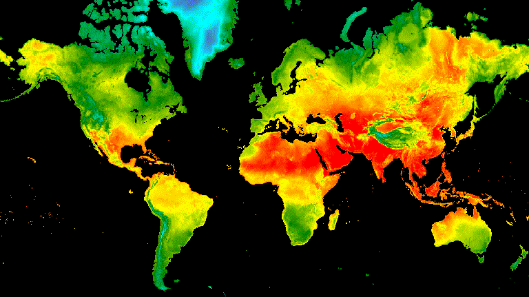

# Prerequisites

Use the steps below to get registered for a Google Earth Engine account and to join our shared repository.

### 1. Registering for a Google Earth Engine account

  - Go the the [GEE sign up page](https://signup.earthengine.google.com/#!/) and enter your gmail account (if not you'll need to create one).
  - You'll see the "Welcome to Earth Engine" introduction page. Now you need to "Register your Cloud Project". 
  - Select Register Noncommercial then Unpaid usage -> Academia & Research -> Confirm.  
  - Enter your email, your affiliation and country/region. 
  - There will be No organization. Create a Project-ID to whatever you like (can't change later). Review terms and accept. 
  - This will redirect you to the Code Editor!
  - Now you can take the tour of the Code Editor if you want.

Not sure if you have access? Use [this link](https://code.earthengine.google.com/) to check. If you didn't get access you will get an authorization error that says your account isn't registered. If you do have access, the link will open up the Javascript IDE. This link is your permanent portal to GEE access.

### 2. Joining our shared GEE code repository

Google Earth Engine allows you to have shared group folders/repositories for scripts. We've organized the code presented in this tutorial this way. You will be given read access to the shared code repository. Please follow these steps:

  - Join the UCD-ECL290 Google Earth Engine repository <a href="https://code.earthengine.google.com/?accept_repo=users/djdixongee/UCD-ECL290" target="_blank">https://code.earthengine.google.com/?accept_repo=users/djdixongee/UCD-ECL290</a> . 
  - In the code editor, go to the **Scripts tab** in the top left panel, scroll down and expand the "Reader" section. A directory called *users/djdixongee/UCD-ECL290* should appear with read-only versions of the full scripts from each module.

Test Link: try running the script users/djdixongee/UCD-ECL290/mod_01/00_start-up

### 3. Javascript Tips

JavaScript, not to be confused with Java, is a programming language widely used in web development alongside HTML and CSS. You can teach yourself JavaScript using any number of online tutorials, such as those offered by <a href="https://www.w3schools.com/js/" target="_blank">w3schools</a> .

For using Google Earth Engine, we enter JavaScript commands into an online integrated development environment (IDE) called the Code Editor. It is not necessary to formally learn JavaScript to work with Google Earth Engine. Below we provide examples and resources for getting started.  

#### Basic JavaScript for GEE
 Here are a few basics useful for GEE, reproduced from the <a href="https://docs.google.com/document/d/1ZxRKMie8dfTvBmUNOO0TFMkd7ELGWf3WjX0JvESZdOE/edit" target="_blank">Earth Engine 101 Beginner's Curriculum</a>.


// Line comments start with two forward slashes. Like this line.

/* Multi-line comments start with a forward slash and a star,
and end with a star and a forward slash. */


Variables are used to store objects and are defined using the keyword **var**.

var theAnswer = 42;

// string objects start and end with a single quote
var myVariable = 'I am a string';

// string objects can also use double quotes, but don't mix and match
var myOtherVariable = "I am also a string";


Statements should end in a semi-colon, or the editor complains.

var test = 'I feel incomplete...'
var test2 = 'I feel complete!';


Passing function parameters and using lists

// Parentheses are used to pass parameters to functions
print('This string will print in the Console tab.');

/* Square brackets are used for items in a list.
The zero index refers to the first item in a list*/
var myList = ['eggplant','apple','wheat'];
print(myList[0]); // would print 'eggplant'


Using dictionaries

// Curly brackets (or braces) can be used to define dictionaries (key:value pairs).
var myDict = {'food':'bread', 'color':'red', 'number':42};

// Square brackets can be used to access dictionary items by key.
print(myDict['color']);

//Or you can use the dot notation to get the same result.
print(myDict.color);


Functions can be defined as a way to reuse code and make it easier to read.

var myHelloFunction = function(string) {
  return 'Hello ' + string + '!';
};
print(myHelloFunction('world'));


  
#### Other JavaScript Resources
JavaScript uses camelCase. JavaScript (according to W3 academy) is easy to learn. Like other programming languages, you can use style guides to learn how to write standard, reproducible (marketable!) code.

For in-depth industry guidance, Google publishes their own definitive <a href="http://google.github.io/styleguide/jsguide.html" target="_blank">JavaScript style guide</a>.

Dana Tomlin has also created a short <a href="https://drive.google.com/file/d/0B3H1GYZLzLKCckwwVjZfVmdPNDA/view)" target="_blank">JavaScript Quick Start Guide/a> which only takes a few minutes to work through but hits some of the basics. You can find it clicking that link or by going to the GEE homepage, clicking on the EDU tab in the upper left, and scrolling down to the Geospatial Software Design Exercises section.

 

  

If you're interested in making gif visualizations with EE data ^^ check this [tutorial](https://developers.google.com/earth-engine/guides/ic_visualization)